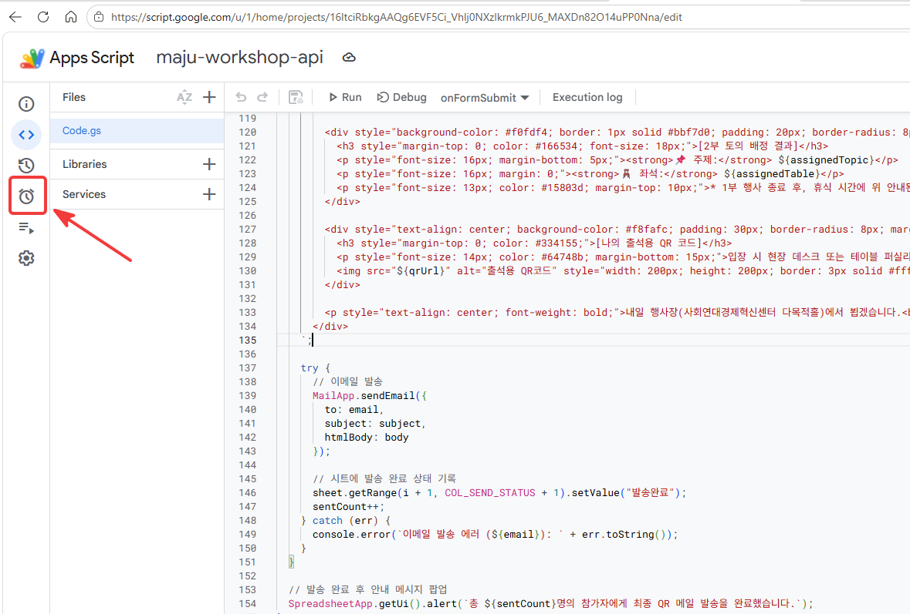
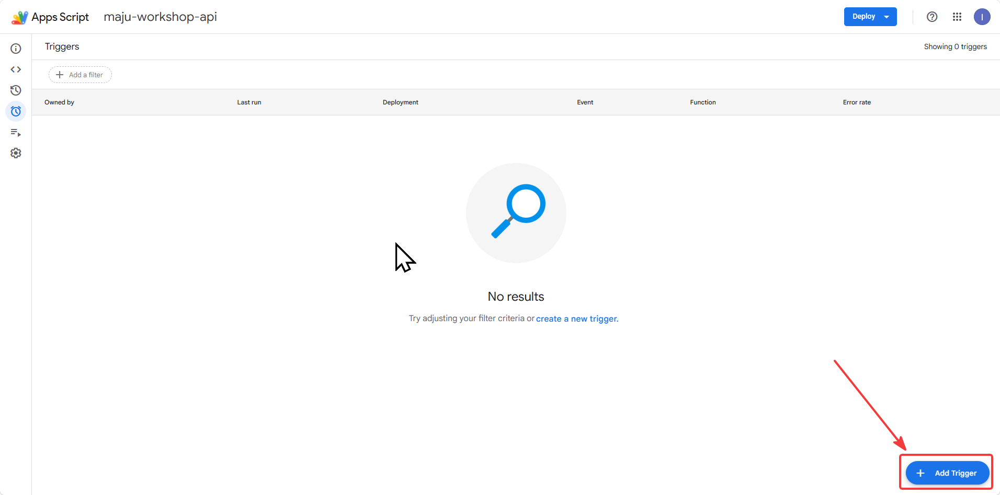
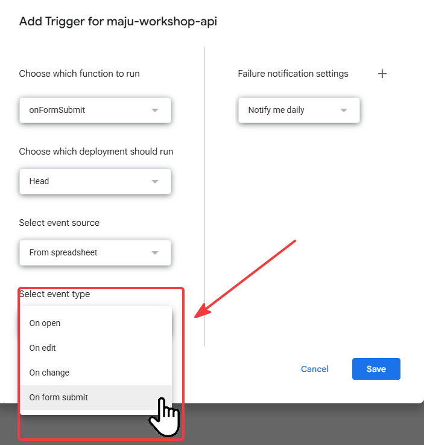
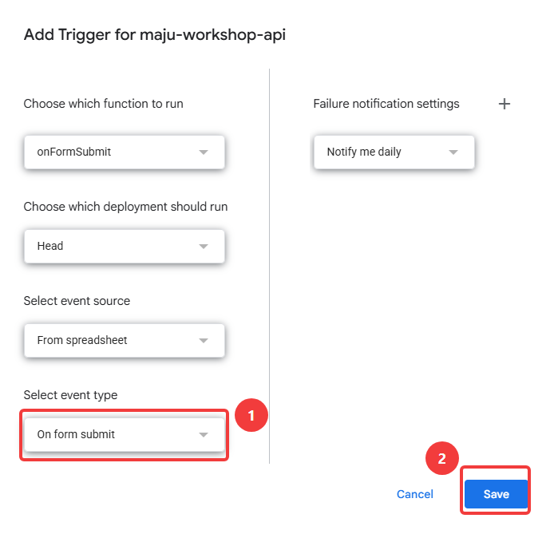
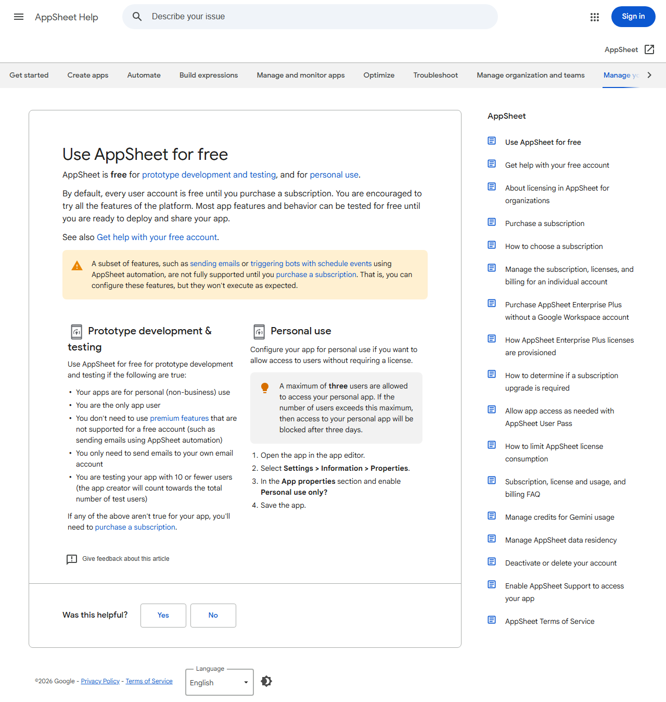
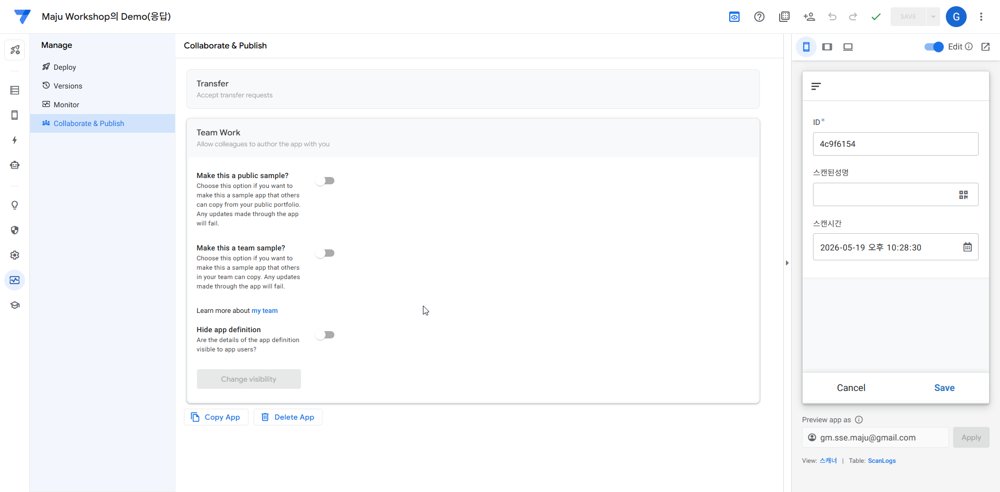

# 광명 사회연대경제혁신센터 디지털 워크숍 운영 가이드

구글 워크스페이스, AppSheet, AI(NotebookLM), 그리고 오픈소스(GM Project)를 결합하여 자동화되고 혁신적인 참여형 워크숍을 진행하는 전체 프로세스와 시스템 설정 가이드입니다.

---

## 🚀 핵심 활용 도구 (Tech Stack)

* **Google Forms/Sheets**: 데이터 수합 및 저장
* **Apps Script**: 이메일 및 로직 자동화
* **AppSheet**: QR 출석 체크 앱
* **NotebookLM**: 실시간 AI 의견 요약
* **GM 오픈소스**: DB 연동 및 아카이빙

---

## 📑 워크숍 진행 3단계 프로세스 (초보자 가이드)

워크숍을 디지털 기반으로 원활하게 운영하기 위해 각 단계별로 담당자가 수행해야 할 구체적인 행동 지침입니다.

### Phase 1 : 사전 작업 (신청 접수 및 자동 안내 메일 세팅)

이 단계에서는 행사 참석자를 모집하고, 신청자에게 자동으로 안내 메일이 가도록 세팅합니다.

1. **구글 폼 제작 및 배포**: 참가자의 이름, 연락처, 이메일, 그리고 워크숍 2부에서 논의하고 싶은 '희망 주제'를 선택할 수 있도록 구글 폼을 만듭니다.
2. **스프레드시트 연동**: 구글 폼의 응답을 구글 스프레드시트로 연결하여 데이터가 한곳에 모이도록 설정합니다.
3. **Apps Script 세팅**: 본 문서 하단의 **[관리자용] 워크숍 자동화 스크립트 설정 가이드**를 따라 세팅을 완료합니다. 이렇게 하면 누군가 폼을 제출할 때마다 환영 인사와 기본 행사 개요가 담긴 메일이 자동으로 발송됩니다.
4. **테이블 배정 및 QR 발송 (행사 전날)**: 구글 스프레드시트에 생긴 `🛠️ 워크숍 관리` 메뉴를 클릭하여, 참가자별로 토의 주제와 테이블 번호를 배정하고, 현장에서 본인 확인용으로 쓰일 '고유 QR코드'가 포함된 최종 안내 메일을 일괄 발송합니다.

### Phase 2 : 현장 진행 (AI를 활용한 실시간 퍼실리테이팅)

행사 당일, 종이와 펜 대신 스마트폰과 AI를 활용해 토의를 진행하는 방법입니다.

1. **모바일 QR 출석체크 (AppSheet 활용)**:
   * 접수처나 각 테이블의 퍼실리테이터(진행자)는 스마트폰에 설치된 AppSheet 앱을 켭니다.
   * 참가자가 입장할 때 전날 받은 메일 속 QR코드를 보여주면, 진행자가 이를 스캔합니다. 스캔 즉시 구글 시트의 '출석 상태'(Q열)가 **출석**으로 실시간 업데이트됩니다.
2. **참가자 모바일 의견 제출 (구글 폼 활용)**:
   * 각 토의 테이블 중앙에는 의견을 낼 수 있는 '의견 제출용 구글 폼 QR코드'가 인쇄되어 있습니다.
   * 참가자들은 본인의 스마트폰으로 테이블의 QR코드를 찍고, 논의 중인 아이디어와 의견을 텍스트로 직접 제출합니다.
3. **AI 실시간 요약 (NotebookLM 활용)**:
   * 각 테이블 퍼실리테이터 또는 관리자가 NotebookLM에 해당 주제 응답 시트를 소스로 연결합니다.
   * AI가 실시간으로 쌓이는 의견을 요약하여 발표 자료를 생성합니다.
4. **실시간 발표**: 10개 테이블의 요약본을 중앙 메인 스크린에 띄워 전체 참가자와 공유합니다.

### Phase 3 : 사후 활동 (데이터 연동 및 피드백)

일회성 행사로 끝나지 않도록, 행사 종료 후 참가자 상태에 따른 맞춤형 메일 발송과 아카이빙을 진행합니다.

1. **출석 기반 맞춤 이메일 발송**:
   * 행사 종료 후 구글 스프레드시트의 `🛠️ 워크숍 관리` 메뉴에서 **`사후 감사/안내 메일 발송 (참석자·불참자)`**을 클릭합니다.
   * 출석 상태(Q열)가 **출석**인 분: 감사 인사 및 결과 요약본 안내 메일 자동 발송
   * 출석 상태(Q열)가 **미출석**인 분: 아쉬움 인사 및 결과 자료 공유 메일 자동 발송
2. **GM 오픈소스 연동** (선택):
   * github.com/durume/GM 프로젝트의 백엔드와 API로 연결하여 웹사이트 회원 DB에 워크숍 참석 이력을 자동 업데이트합니다.
3. **데이터 영구 보관**:
   * 행사 중 수집된 의견 원본과 AI 요약본, 현장 사진 등은 구글 드라이브 내 지정된 폴더에 정리하여 향후 센터 운영 정책에 반영할 자산으로 아카이빙합니다.

---

## 🔄 시스템 데이터 흐름도

1. **참가자**: 신청 및 모바일 의견 제출
2. **Google Workspace**: Forms, Sheets로 데이터 중앙화
3. **AI & 연동**: NotebookLM(실시간 데이터 연동 및 요약) 및 GM 오픈소스(API를 통한 회원 이력 연동)

---

## 🗂️ 스프레드시트 컬럼 구조

구글 폼 응답 시트(`설문지 응답 시트1`)의 열 구조입니다. 스크립트가 읽고 쓰는 열을 확인할 때 참고하세요.

| 열 | 헤더 | 내용 | 출처 |
| --- | --- | --- | --- |
| A | 타임스탬프 | 제출 일시 | 폼 자동 생성 |
| B | 이름 | 참가자 성명 | 참가자 입력 |
| C | 연락처 | 전화번호 | 참가자 입력 |
| D | 연령대 | 연령대 선택 | 참가자 입력 |
| E | 성별 | 성별 선택 | 참가자 입력 |
| F | 소속 | 기관/단체명 | 참가자 입력 |
| G | 행사 인식 채널 | 어디서 알았나 | 참가자 입력 |
| H | 참여 동기 | 참여 이유 | 참가자 입력 |
| I | 2부 토의주제 | 희망 주제 선택(복수) | 참가자 입력 |
| J | 이메일 | 이메일 주소 | 참가자 입력 |
| K | 기타의견 | 자유 의견 | 참가자 입력 |
| L | 개인정보활용동의 | 동의 여부 | 참가자 입력 |
| **M** | **배정된 주제** | 1지망 기준 자동 배정 | **스크립트 기록** |
| **N** | **테이블 번호** | Table 1~10 배정 | **스크립트 기록** |
| **O** | **QR 코드 URL** | 이메일에 삽입된 QR 이미지 URL | **스크립트 기록** |
| **P** | **체크인 코드** | `이름\|이메일` 형식 (AppSheet 조회 기준) | **스크립트 기록** |
| **Q** | **출석 상태** | 미출석 / 출석 | **AppSheet 업데이트** |
| **R** | **최종메일발송상태** | 발송완료 / 사후메일발송완료 | **스크립트 기록** |

---

## 🛠️ [관리자용] 워크숍 자동화 스크립트 설정 가이드

> ⚠️ **중요 안내**
>
> 자동 발송되는 이메일의 **발신자 주소를 공식 계정으로 설정하기 위해, 반드시 해당 계정으로 로그인하신 후 아래의 과정을 직접 수행해 주셔야 합니다.** 다른 편집자가 설정을 완료하면 그 편집자의 이메일 주소로 메일이 발송됩니다.

### 1단계: 스크립트 저장 및 확인

1. 워크숍 응답이 수집되고 있는 구글 스프레드시트를 엽니다.
2. 상단 메뉴에서 **[확장 프로그램] → [Apps Script]**를 클릭하여 스크립트 편집기 화면을 엽니다.
3. `code.gs`의 코드를 붙여넣고 상단의 **저장 아이콘(💾)**을 클릭하여 저장합니다.

### 2단계: 시트 이름 확인 (중요)

스크립트는 **`설문지 응답 시트1`**이라는 이름의 시트에서 데이터를 읽어옵니다.

1. 구글 스프레드시트로 돌아가서, 구글 폼 응답이 들어오는 하단 탭의 이름이 **`설문지 응답 시트1`**인지 확인합니다.
2. 만약 시트 이름이 다르다면, 시트 이름을 `설문지 응답 시트1`로 바꾸거나, 코드에서 `getSheetByName("설문지 응답 시트1")`을 실제 시트 이름과 동일하게 수정 후 저장해 주세요.

### 3단계: 자동 메일 발송 트리거(Trigger) 설정

폼이 제출될 때마다 자동으로 신청자에게 완료 안내 메일을 보내도록 설정하는 과정입니다.

1. Apps Script 화면의 왼쪽 메뉴에서 시계 모양 아이콘인 **[트리거]**를 클릭합니다.

2. 화면 우측 하단의 **[+ 트리거 추가]** 버튼을 클릭합니다.

3. 나타나는 설정 창에서 아래와 같이 옵션을 맞춰줍니다.
   * 실행할 함수 선택: **`onFormSubmit`**
   * 실행할 배포 선택: **`Head`**
   * 이벤트 소스 선택: **`스프레드시트에서`**
   * 이벤트 유형 선택: **`양식 제출 시`**

4. 파란색 **[저장]** 버튼을 클릭합니다.


### 4단계: 계정 권한 허용 (최초 1회)

트리거를 저장하거나 스크립트를 처음 실행할 때, 스크립트가 메일을 보내고 시트를 읽을 수 있도록 허용하는 보안 인증 과정이 나타납니다.

1. "권한 필요" 팝업창이 뜨면 **[권한 검토]**를 클릭합니다.
2. 현재 로그인된 본인의 구글 계정을 선택합니다.
3. "Google에서 확인하지 않은 앱"이라는 경고 창이 뜰 수 있습니다. 왼쪽 아래의 **[고급]** 글자를 클릭합니다.
4. 아래로 펼쳐진 내용 중 맨 밑에 있는 **[(프로젝트 이름)(으)로 이동(안전하지 않음)]** 링크를 클릭합니다.
5. 스크롤을 맨 아래로 내려서 **[허용]** 버튼을 클릭합니다.

이제 폼 제출 시 접수 완료 메일이 자동 발송됩니다! 테스트 응답을 제출하여 정상 작동하는지 확인해 보세요.

### 5단계: 관리자용 메뉴 확인하기

1. 열어두었던 구글 스프레드시트 창으로 돌아가서 **새로고침(F5)**을 합니다.
2. 시트가 로딩되고 몇 초 기다리면, 상단 메뉴바 맨 오른쪽에 **`🛠️ 워크숍 관리`**라는 새로운 메뉴가 생긴 것을 볼 수 있습니다.
3. 메뉴에는 다음 3가지 기능이 있습니다:
   * **최종 안내 및 QR 메일 일괄 발송** → 행사 전날 실행
   * **사후 감사/안내 메일 발송 (참석자·불참자)** → 행사 종료 후 실행
   * **2부 주제별 의견수집 폼 생성** → 행사 전 준비 시 실행

---

## 📱 AppSheet QR 출석 체크 앱 설정 가이드

> AppSheet를 처음 사용하는 분도 따라할 수 있도록 화면 단위로 상세히 작성한 가이드입니다.
>
> 📖 **참고 자료**: 이 가이드는 [행사 자동화 관리 시스템 — 이메일 확인 및 QR 스캔 가이드](https://github.com/durume/GM/blob/main/gm-social-economy-center/EventAutomation/email-confirmation-and-QR-scan.md)의 아키텍처를 기반으로, 이 프로젝트의 데이터 형식(`이름|이메일`)과 시트 구조(`설문지 응답 시트1`)에 맞게 작성되었습니다.

**QR 흐름 요약**: 참가자 QR 스캔 → `ScanLogs` 시트에 기록 → `자동출석트리거` Action 실행 → `설문지 응답 시트1`의 `출석 상태`(Q열)를 `"출석"`으로 업데이트 → `code.gs`가 참석자 구분

### 🔍 AppSheet란?

AppSheet는 코딩 없이 Google Sheets를 기반으로 스마트폰 앱을 만드는 Google의 무료(기본 요금제) 서비스입니다. 이 가이드에서는 AppSheet로 **QR 스캐너 앱**을 만들어 현장 출석 체크에 활용합니다.

### 📋 시작 전 준비물 확인

설정을 시작하기 전에 아래 항목이 모두 준비되어 있는지 확인하세요.

* ☐ 워크숍 응답 스프레드시트가 열려 있고 참가자 데이터가 입력되어 있음
* ☐ `code.gs`의 `sendFinalNoticeWithQR`을 실행하여 P열(체크인 코드)에 `이름|이메일` 형식 데이터가 채워져 있음
* ☐ 구글 계정으로 [appsheet.com](https://www.appsheet.com) 로그인 가능

---

### 이 프로젝트의 QR 코드 데이터 형식

`code.gs`의 `onFormSubmit`이 폼 제출 시 P열(체크인 코드)에 아래 형식으로 자동 저장합니다.

```text
이름|이메일
예: 홍길동|hong@example.com
```

AppSheet가 QR을 스캔하면 이 문자열을 읽어 `|`로 분리하여 이름과 이메일을 각각 추출합니다.

---

### 0단계: ScanLogs 시트 만들기 (Google Sheets에서)

AppSheet 설정 전에, 스캔 기록을 저장할 시트를 먼저 만들어야 합니다.

1. 워크숍 응답 스프레드시트를 엽니다.
2. 하단 탭 옆의 **`+`** 버튼을 눌러 새 시트를 추가합니다.
3. 시트 이름을 **`ScanLogs`**로 정확히 입력합니다. (대소문자, 띄어쓰기 주의)
4. `ScanLogs` 시트의 첫 번째 행(1행)에 아래 헤더를 입력합니다.

   | A1 | B1 | C1 | D1 |
   | --- | --- | --- | --- |
   | ID | 체크인코드 | 스캔된이메일 | 스캔시간 |

   > ℹ️ B1을 `체크인코드`로 지정하는 이유: AppSheet에서 이 열에 QR 원시값(`이름|이메일` 전체)이 저장됩니다. 퍼실리테이터 화면에는 이름만 보이는 별도 가상 컬럼을 추가할 것이므로 헤더 이름을 명확히 구분합니다.

5. 헤더만 입력하고 데이터는 비워둡니다. AppSheet가 스캔할 때마다 자동으로 채웁니다.

> ✅ **확인**: 시트 탭에 `설문지 응답 시트1`과 `ScanLogs` 두 개의 탭이 보이면 준비 완료입니다.

---

### 1단계: AppSheet 앱 생성

#### 1-1. appsheet.com 접속 및 로그인

1. 웹 브라우저에서 [appsheet.com](https://www.appsheet.com)을 엽니다.
2. 우측 상단 **[Sign in]** 버튼 → **[Sign in with Google]** → 워크숍 스프레드시트를 소유한 구글 계정으로 로그인합니다.

#### 1-2. 새 앱 만들기

1. 로그인 후 대시보드에서 **[+ Create]** 버튼(또는 **[Make a new app]**)을 클릭합니다.
2. 팝업에서 **[Start with existing data]**를 선택합니다.
3. 앱 이름 입력란에 **`마주센터 출석체크`** (또는 원하는 이름)를 입력합니다.
4. 카테고리는 **[Other]**를 선택합니다.
5. **[Choose your data]** 화면에서 **[Google Sheets]** 아이콘을 클릭합니다.
6. 구글 드라이브 선택창이 열립니다. 워크숍 응답 스프레드시트를 찾아 선택합니다.
   * 검색창에 스프레드시트 이름의 일부를 입력하면 빠르게 찾을 수 있습니다.
7. 시트 목록이 표시되면 **`설문지 응답 시트1`**을 선택합니다.
8. **[Next]** 버튼을 눌러 앱 편집 화면으로 진입합니다.

> ℹ️ 앱 편집 화면에는 좌측에 **Data**, **UX**, **Automation**, **Security**, **Manage** 탭이 있습니다. 이 가이드는 Data, Automation, UX 탭을 순서대로 사용합니다.

---

### 2단계: ScanLogs 데이터 소스 추가

앱 편집 화면에서 `ScanLogs` 시트를 추가합니다.

1. 좌측 메뉴에서 **[Data]** 탭을 클릭합니다.
2. 화면 상단에 `설문지 응답 시트1` 테이블이 보입니다. 그 옆의 **[+]** 버튼(Add Table)을 클릭합니다.
3. **[Google Sheets]**를 선택합니다.
4. 다시 동일한 워크숍 스프레드시트를 선택합니다.
5. 시트 목록에서 **`ScanLogs`**를 선택합니다.
6. **[Add Sheet]**를 클릭합니다.

> ✅ **확인**: Data 탭에 `설문지 응답 시트1`과 `ScanLogs` 두 개의 테이블이 보이면 성공입니다.

---

### 3단계: 컬럼 설정 (Data > Columns)

이 단계가 가장 중요합니다. 각 컬럼의 **타입(Type)**과 **속성(Properties)**을 정확히 설정해야 QR 스캔이 올바르게 작동합니다.

#### 3-A. `설문지 응답 시트1` 컬럼 설정

1. **[Data]** 탭에서 **`설문지 응답 시트1`** 테이블을 클릭합니다.
2. 우측에 컬럼 목록이 표시됩니다. 아래 컬럼들을 찾아 설정합니다. 나머지 컬럼은 기본값으로 두어도 됩니다.

##### 이메일 컬럼 설정 (Key 지정)

1. `이메일` 컬럼의 연필 아이콘(✏️)을 클릭합니다.
2. **Type**: `Email`로 변경합니다.
3. **Key**: 체크박스를 **켭니다(ON)**. 이 열이 각 참가자를 고유하게 구분하는 기준이 됩니다.
4. **[Done]**을 클릭합니다.

> ⚠️ Key는 반드시 하나의 컬럼에만 설정해야 합니다. 다른 컬럼에 Key가 이미 설정되어 있다면 해제해 주세요.

##### 이름 컬럼 설정

1. `이름` 컬럼의 연필 아이콘을 클릭합니다.
2. **Type**: `Text` 확인 (기본값)
3. **Label**: 체크박스를 **켭니다(ON)**. 앱 화면에서 참가자 이름이 대표 표시 값이 됩니다.
4. **[Done]**을 클릭합니다.

##### 출석 상태 컬럼 설정

1. `출석 상태` 컬럼의 연필 아이콘을 클릭합니다.
2. **Type**: **`Text`**를 선택합니다.
3. **Editable**: 체크박스를 **켭니다(ON)**.
4. **Valid if**에 아래 수식을 입력합니다.

   ```text
   LIST("출석", "미출석")
   ```

5. **[Done]**을 클릭합니다.

> ℹ️ **설계 의도**: Valid if에 `LIST()`를 반환하면 AppSheet가 자동으로 드롭다운 선택창을 만들고, 목록에 없는 값은 저장을 차단합니다. `출석 상태`를 Text 타입으로 유지하면 차트 범례가 **출석** / **미출석**으로 직접 표시됩니다.

#### 3-B. `ScanLogs` 컬럼 설정

1. **[Data]** 탭에서 **`ScanLogs`** 테이블을 클릭합니다.

##### ID 컬럼 설정

1. `ID` 컬럼의 연필 아이콘을 클릭합니다.
2. **Type**: `Text`
3. **Key**: **켭니다(ON)**
4. **Initial value**: `=UNIQUEID()` 입력 (매 스캔마다 고유 ID 자동 생성)
5. **Show**: **끕니다(OFF)** — 사용자 화면에 ID 칸이 보이지 않게 합니다.
6. **[Done]**을 클릭합니다.

##### 체크인코드 컬럼 설정 (QR 원시 입력 — 숨김)

이 컬럼이 실제로 QR을 스캔하는 입력창입니다. QR 원시값(`이름|이메일` 전체)이 저장되며, 퍼실리테이터 화면에서는 숨깁니다.

1. `체크인코드` 컬럼의 연필 아이콘을 클릭합니다.
2. **Type**: `Text`
3. 페이지 하단의 **[Other Properties]**를 펼칩니다.
4. **Scannable** 체크박스를 **켭니다(ON)**.
   * Scannable을 켜면 스마트폰 앱에서 이 입력창 옆에 카메라 QR 아이콘이 나타납니다.
5. **Show**: **끕니다(OFF)** — 퍼실리테이터 화면에 원시값이 노출되지 않도록 숨깁니다.
6. **[Done]**을 클릭합니다.

> ⚠️ QR 카메라 아이콘은 **스마트폰의 AppSheet 앱에서만** 보입니다. PC 웹 브라우저에서는 보이지 않는 것이 정상입니다.

##### 스캔된 이름 컬럼 추가 (이름만 표시하는 가상 컬럼)

퍼실리테이터가 스캔 후 확인하는 화면에 이름만 깔끔하게 보이도록, `체크인코드`에서 `|` 앞의 이름 부분만 추출하는 가상 컬럼을 추가합니다.

1. 컬럼 목록 하단의 **[+ Add virtual column]** 버튼을 클릭합니다.
2. 컬럼 이름에 **`스캔된 이름`**을 입력합니다.
3. **Type**: `Text`
4. **App formula**에 아래 수식을 입력합니다.

   ```text
   INDEX(SPLIT([체크인코드], "|"), 1)
   ```

5. **[Done]**을 클릭합니다.

> ℹ️ 이렇게 하면 `체크인코드`에 `홍길동|hong@example.com`이 저장돼도 퍼실리테이터 화면에는 `스캔된 이름: 홍길동`만 표시됩니다.

##### 스캔된 이메일 컬럼 설정 (자동 추출)

1. `스캔된 이메일` 컬럼의 연필 아이콘을 클릭합니다.
2. **Type**: `Text`
3. **Initial value**에 아래 수식을 입력합니다.

   ```text
   INDEX(SPLIT([체크인코드], "|"), 2)
   ```

4. **Editable**: **끕니다(OFF)**
5. **[Done]**을 클릭합니다.

##### 참가자찾기 컬럼 추가 (Virtual Ref 컬럼 — 핵심)

이 컬럼은 `체크인코드`에서 이름·이메일을 추출하여 `설문지 응답 시트1`에서 해당 참가자를 찾아주는 "링크" 역할을 합니다.

1. 컬럼 목록 하단의 **[+ Add virtual column]** 버튼을 클릭합니다.
2. 컬럼 이름에 **`참가자찾기`**를 입력합니다.
3. **Type**: **`Ref`**를 선택합니다.
4. **Source table**: **`설문지 응답 시트1`**을 선택합니다.
5. **App formula**에 아래 수식을 입력합니다.

   ```text
   ANY(
     SELECT(설문지 응답 시트1[이름],
       AND(
         [이름] = INDEX(SPLIT([체크인코드], "|"), 1),
         [이메일] = INDEX(SPLIT([체크인코드], "|"), 2)
       )
     )
   )
   ```

6. **Show**: **끕니다(OFF)**
7. **[Done]**을 클릭합니다.

##### 스캔시간 컬럼 설정

1. `스캔시간` 컬럼의 연필 아이콘을 클릭합니다.
2. **Type**: `DateTime`
3. **Initial value**: `NOW()` 입력 (스캔 시점의 시간이 자동 기록됨)
4. **Editable**: **끕니다(OFF)**
5. **[Done]**을 클릭합니다.

컬럼 설정 완료 요약표:

| 컬럼명 | 타입 | Initial value | App formula | 특이 설정 |
| --- | --- | --- | --- | --- |
| ID | Text | `=UNIQUEID()` | — | Key 🔑, Show OFF |
| 체크인코드 | Text | — | — | **Scannable ON**, Show OFF (QR 원시값 저장) |
| 스캔된성명 | Text (Virtual) | — | `INDEX(SPLIT([체크인코드], "\|"), 1)` | 이름만 표시 |
| 스캔된이메일 | Text | `INDEX(SPLIT([체크인코드], "\|"), 2)` | — | Editable OFF |
| 참가자찾기 | Ref → `설문지 응답 시트1` | — | *(위 수식)* | Virtual, Show OFF |
| 스캔시간 | DateTime | `NOW()` | — | Editable OFF |

---

### 4단계: Action 설정 (Automation > Actions)

Action은 "어떤 일이 생겼을 때 자동으로 무언가를 실행하는 규칙"입니다. QR을 스캔하면 자동으로 출석 상태가 바뀌도록 Action을 두 개 만듭니다.

#### Action 1 — `출석상태변경` (참가자 시트의 출석 상태 바꾸기)

1. 좌측 메뉴 **[Automation]** → **[Actions]**를 클릭합니다.
2. **[+ New Action]** 버튼을 클릭합니다.
3. 아래와 같이 입력합니다.

   | 항목 | 입력값 | 설명 |
   | --- | --- | --- |
   | Action name | `출석상태변경` | 이 Action의 이름 |
   | For a record of this table | `설문지 응답 시트1` | 어떤 테이블의 행을 변경할 것인지 |
   | Do this | `Data: set the values of some columns in this row` | 특정 컬럼 값을 바꾸는 Action |

4. **[Add]** 버튼(Column Inputs 섹션의 **[+]**)을 클릭하여 변경할 컬럼을 추가합니다.
   * 컬럼 선택: **`출석 상태`**
   * 값(Value): **`"출석"`** (큰따옴표 포함하여 입력)
5. **Position**: `Hide`를 선택합니다. (앱 화면에 버튼으로 표시하지 않음)
6. **[Done]**을 클릭합니다.

> ⚠️ 값을 입력할 때 반드시 **`"출석"`** (큰따옴표 포함)로 입력하세요. `TRUE`, `1`, `출석`(따옴표 없음)으로 입력하면 사후 메일 발송 스크립트가 출석자를 인식하지 못합니다.

#### Action 2 — `자동출석트리거` (스캔 저장 시 Action 1을 자동 실행)

1. 다시 **[+ New Action]** 버튼을 클릭합니다.
2. 아래와 같이 입력합니다.

   | 항목 | 입력값 | 설명 |
   | --- | --- | --- |
   | Action name | `자동출석트리거` | 이 Action의 이름 |
   | For a record of this table | `ScanLogs` | ScanLogs에 새 행이 추가될 때 실행 |
   | Do this | `Data: execute an action on a set of rows` | 다른 테이블의 행에 Action 실행 |
   | Referenced Table | `설문지 응답 시트1` | Action을 실행할 대상 테이블 |
   | Referenced Rows | `LIST([참가자찾기])` | 찾아낸 참가자 행 |
   | Referenced Action | `출석상태변경` | 실행할 Action (방금 만든 Action 1) |
   | Position | `Hide` | 앱 화면에 버튼 표시 안 함 |

3. **[Done]**을 클릭합니다.

> ℹ️ **동작 흐름**: QR 스캔 → `ScanLogs`에 새 행 추가 → `자동출석트리거` 실행 → `참가자찾기`로 해당 참가자를 `설문지 응답 시트1`에서 찾음 → `출석상태변경` Action이 그 참가자의 `출석 상태`를 `"출석"`으로 변경

---

### 5단계: 뷰(화면) 설정

AppSheet 뷰는 "사용자가 보는 화면"입니다. 이 단계에서는 세 가지 화면을 만들고, 하단 탭으로 연결합니다.

```text
앱 화면 구조
├── 🏠 홈 (대시보드)       ← 기본 시작 화면: 실시간 출석 현황 차트
│     └── [스캐너로 이동] 버튼
└── 📷 스캐너             ← QR 스캔 화면
```

> ℹ️ AppSheet는 QR 스캔으로 Google Sheets Q열이 업데이트될 때마다 앱이 자동으로 데이터를 다시 불러옵니다. 홈 화면의 차트는 스캔할 때마다 실시간으로 갱신됩니다.

---

#### 5-1: 스캐너 뷰 설정 (QR 스캔 화면)

1. 좌측 메뉴 **[UX]** → **[Views]**를 클릭합니다.
2. 목록에서 **`ScanLogs_Form`** 뷰를 클릭합니다. (없으면 **[+ New View]** → View type: `Form` → Data: `ScanLogs` 선택)
3. 뷰 이름을 **`스캐너`**로 변경합니다.
4. **[Behavior]** 섹션을 펼칩니다.
   * **Event Actions** → **Form Saved** 드롭다운에서 **`자동출석트리거`**를 선택합니다.
5. **[Navigation]** 섹션을 펼칩니다.
   * **Finish view**: **`스캐너`**를 선택합니다. (스캔 저장 후 같은 화면으로 복귀)
6. **[Done]**을 클릭합니다.

---

#### 5-2: 출석 현황 차트 뷰 설정

QR 스캔 현황을 파이 차트로 보여주는 뷰입니다. 이 뷰는 홈 대시보드에 삽입됩니다.

1. **[+ New View]** 버튼을 클릭합니다.
2. 아래와 같이 설정합니다.

   | 항목 | 설정값 |
   | --- | --- |
   | View name | `출석현황` |
   | For this data | `설문지 응답 시트1` |
   | View type | `Chart` |

3. **View Options** 섹션에서 아래 항목을 순서대로 설정합니다.

   **Chart type**: 아이콘 중 **`aggregate piechart`** 를 클릭합니다.


   > ℹ️ AppSheet에는 "Bar" 차트가 없습니다. 출석 비율 확인에는 `aggregate piechart`, 도넛 형태를 원하면 `aggregate donutchart`를 선택하세요.

   **Group aggregate**: **`COUNT`** 선택

   **Chart columns**: **[Add]** 버튼을 클릭 → **`출석 상태`** 선택

   **Label type**: **`Value`** 선택

   > ⚠️ 기본값을 **반드시 `Value`로 변경**하세요. 현장에서는 "75%" 보다 "15명 출석"처럼 실제 인원 수가 훨씬 유용합니다.

   **Show legend**: **ON** (출석/미출석 레이블이 차트 옆에 표시됨)

4. **Position**: **`middle`** 또는 하단 탭에서 원하는 위치를 선택합니다.
5. **[Done]**을 클릭합니다.

> ℹ️ **차트 읽는 법**: **출석** 영역 = QR 스캔 완료 인원, **미출석** 영역 = 아직 미스캔 인원. 합계 = 총 신청자 수.

---

#### 5-3: 홈 대시보드 뷰 설정

출석 현황 차트와 스캐너 바로가기를 한 화면에 모아 보여주는 홈 화면입니다.

1. **[+ New View]** 버튼을 클릭합니다.
2. 아래와 같이 설정합니다.

   | 항목 | 설정값 |
   | --- | --- |
   | View name | `홈` |
   | View type | `Dashboard` |

3. **Dashboard Slices** 섹션에서 **[+ Add slice]**를 클릭하여 슬라이스를 추가합니다.

   **Slice 1 — 출석 현황 차트**

   | 항목 | 설정값 |
   | --- | --- |
   | View | `출석현황` |
   | Size | `Large` |
   | Position | Top (첫 번째) |

   **Slice 2 — 스캐너 이동 버튼**

   **[+ Add slice]**를 다시 클릭합니다.

   | 항목 | 설정값 |
   | --- | --- |
   | View | `스캐너` |
   | Size | `Small` |
   | Position | Bottom (두 번째) |

4. **Show in**: `Primary` — 홈 화면은 하단 탭에 표시합니다.
5. **[Done]**을 클릭합니다.

> ✅ 대시보드 화면에 차트와 스캐너 뷰 미리보기가 나란히 보이면 설정 완료입니다. 스캐너 슬라이스를 탭하면 스캐너 화면으로 이동합니다.

---

#### 5-4: 하단 내비게이션(탭) 순서 설정

앱 하단 탭의 순서를 `홈 → 스캐너`로 정렬하여 앱 시작 시 대시보드가 기본으로 열리게 합니다.

1. **[UX]** → **[Navigation]** (또는 **[Primary Navigation]**)을 클릭합니다.
2. 뷰 목록에서 **`홈`**을 맨 위로 드래그합니다.
3. **`스캐너`**를 두 번째로 정렬합니다.
4. 나머지 자동 생성된 뷰들은 `Do not show`로 설정하거나 목록에서 제거합니다.
5. **[Save]**를 클릭합니다.

> ✅ **최종 확인**: 미리보기 패널에서 앱이 `홈(대시보드)` 화면으로 시작하고, 하단에 `홈`과 `스캐너` 탭 두 개가 보이면 완료입니다.

---

### 6단계: 앱 저장 및 배포

1. 화면 우측 상단의 **[Save]** 버튼을 클릭하여 앱을 저장합니다.
2. AppSheet가 자동으로 앱을 배포(Deploy)합니다. 첫 배포 후 에러 경고창이 뜰 수 있습니다.
   * **Deployment Check** 결과에 오류(빨간색)가 있으면 내용을 확인하고 수정하세요.
   * 경고(노란색)는 무시해도 됩니다.

> ✅ **확인**: 화면 오른쪽 미리보기(Preview) 패널에서 스마트폰 화면이 보이면 앱 생성 성공입니다.

#### Free 요금제에서 퍼실리테이터 접근 허용 방법

AppSheet 공식 문서([Use AppSheet for free](https://support.google.com/appsheet/answer/10104499)) 기준:

> "AppSheet is free for **prototype development and testing**. Up to **10 users** (including the creator) can access the app at no cost."

즉, 앱이 **프로토타입(테스트) 상태**이면 제작자 포함 최대 10명이 무료로 사용할 수 있습니다. 퍼실리테이터가 "User signin not allowed" 오류를 만나면 아래 방법을 시도하세요.



##### 방법 A — 앱 오너 계정 공유 (가장 빠름)

현장 당일, 퍼실리테이터 스마트폰에 앱 오너 계정(`gm.sse.maju@gmail.com`)으로 AppSheet에 로그인합니다. 행사 후 로그아웃하면 됩니다. 별도 설정 없이 즉시 사용 가능합니다.

##### 방법 B — 앱 설치 링크로 테스터 초대 (각자 본인 계정 사용)

1. AppSheet 편집 화면 상단의 공유 아이콘(👤+) 또는 **Manage > Deploy**에서 **앱 설치 링크(install link)**를 복사합니다.
2. 퍼실리테이터에게 링크를 공유합니다. (카카오톡, 이메일 등)
3. 퍼실리테이터가 링크를 열고 **본인 구글 계정**으로 로그인하면 앱이 설치됩니다.
4. 오류가 계속 발생하면 앱이 프로토타입 상태인지 확인합니다. **Manage > Deploy**에서 "Deployment Check"를 통과하기 전 상태(프로토타입)여야 합니다.

> ℹ️ **Collaborate & Publish 화면**은 사용자 초대가 아닌 앱 복사/샘플 공유용입니다 (아래 참고).



> ⚠️ AppSheet UI 및 정책은 지속적으로 변경됩니다. 최신 정보는 [AppSheet 공식 문서](https://support.google.com/appsheet/answer/10104499)를 확인하세요.

---

### 7단계: 퍼실리테이터 스마트폰 설치 및 테스트

#### 앱 설치

1. 행사 당일 출석 체크를 담당할 퍼실리테이터의 스마트폰에서 **AppSheet** 앱을 설치합니다.
   * iOS: App Store에서 "AppSheet" 검색
   * Android: Play Store에서 "AppSheet" 검색
2. 앱 오너 계정 또는 퍼실리테이터 본인 계정(접근 허용된 경우)으로 AppSheet에 로그인합니다.
3. 앱 목록에서 **`마주센터 출석체크`** 앱을 탭합니다.

#### 테스트 스캔

1. 앱에서 **[스캐너]** (또는 `ScanLogs_Form`) 메뉴를 탭합니다.
2. **[체크인코드]** 입력창을 탭합니다. 오른쪽에 QR 코드 모양 아이콘(📷)이 보여야 합니다.
3. 아이콘을 탭하면 카메라가 켜집니다. 참가자가 이메일로 받은 QR 코드를 카메라로 비춥니다.
4. QR 스캔이 되면 `체크인코드` 필드에 `홍길동|hong@example.com` 형식의 텍스트가 자동 입력되고, `스캔된성명` 필드에는 `홍길동`만 표시됩니다.
5. **[Save]** 버튼을 탭합니다.
6. 구글 스프레드시트 `설문지 응답 시트1`에서 해당 참가자의 Q열(`출석 상태`)이 **출석**으로 바뀌었는지 확인합니다.

> ⚠️ **자주 발생하는 문제**
>
> | 증상 | 원인 | 해결 방법 |
> | --- | --- | --- |
> | Q열이 Y로 안 바뀐다 | `자동출석트리거` Action이 연결 안 됨 | 5단계에서 Form Saved에 `자동출석트리거` 선택 확인 |
> | `참가자찾기`가 빈값 | App formula 수식 오타 | `[체크인코드]` 참조 및 `\|` 파이프 문자가 맞는지 확인 |
> | QR 아이콘이 안 보인다 | PC 브라우저 사용 중 | 스마트폰 앱에서만 표시됨 (정상) |
> | `출석 상태`가 `출석` 대신 `TRUE`로 기록 | Action 값 설정 오류 | Action 1에서 값을 `"출석"` (큰따옴표 포함)로 입력 |
> | 앱이 목록에 안 보인다 | 다른 계정으로 로그인 중 | 앱을 만든 구글 계정으로 다시 로그인 |
> | "User signin not allowed" 오류 | Free 요금제 제한 | 6단계의 방법 A(계정 공유) 또는 방법 B(설치 링크) 참고 |

---

> 💡 **운영 흐름 전체**: 행사 전날 `sendFinalNoticeWithQR` 실행 → Q열 `"미출석"` 초기화 + QR 메일 발송 → 행사 당일 AppSheet QR 스캔 → Q열 `"출석"` 업데이트 → 행사 후 `사후 감사/안내 메일 발송` 실행 → Q열 값 기준으로 참석자/불참자 자동 분류 발송

---

## 🚀 2부 워크숍: 주제별 의견 수집 자동화

2부 워크숍은 토의 주제별로 의견 수집용 폼이 필요합니다. 일일이 만들 필요 없이 관리 메뉴에서 한 번에 생성할 수 있습니다.

### 1. 주제별 구글 폼 일괄 생성

1. 스프레드시트 상단 **`🛠️ 워크숍 관리`** 메뉴를 클릭합니다.
2. **`2부 주제별 의견수집 폼 생성`**을 클릭합니다.
3. 실행이 완료되면 스프레드시트에 **'폼 생성 결과'**라는 새로운 시트가 생기며, 각 주제별 구글 폼 링크가 나열됩니다.
4. 이 링크들을 각 테이블에 비치하거나 QR코드로 만들어 참가자들이 의견을 남길 수 있게 안내하세요.

### 2. 의견 수집 및 AI 활용 (고급)

* **자동 수집**: 참가자들이 폼을 제출하면 해당 주제의 응답 시트에 실시간으로 의견이 쌓입니다.
* **AI 요약**: 응답 시트에서 `=AI_SUMMARIZE(범위)` 함수를 사용하여 의견들을 자동으로 요약하거나 분석할 수 있는 기반을 마련해 두었습니다. (Gemini API 등 연동 필요)
* **NotebookLM 활용**: 각 주제별 응답 시트의 URL을 [NotebookLM](https://notebooklm.google/)에 소스로 추가하면, AI와 대화하며 테이블별 논의 내용을 깊이 있게 분석할 수 있습니다.

### 💡 참고 사항 (발송 한도)

일반 개인 구글 계정(@gmail.com)은 구글 정책상 스크립트를 통한 이메일 발송이 **하루 최대 100건**으로 제한됩니다. (Google Workspace 기업용 계정은 하루 1,500건). 신청자가 많아 최종 안내 메일을 100건 이상 보내야 한다면 이틀에 걸쳐서 발송하시는 것을 권장합니다. (이미 발송된 사람에게는 중복 발송되지 않도록 코드가 짜여 있습니다.)
