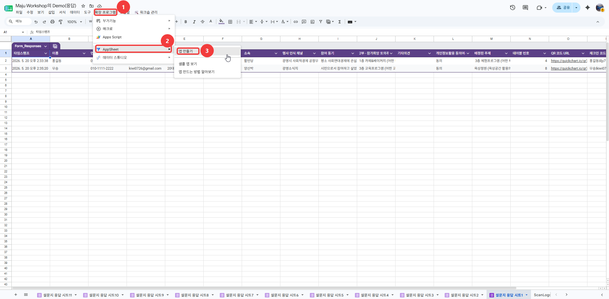

# 광명 사회연대경제혁신센터 디지털 워크숍 운영 가이드

구글 워크스페이스, AppSheet, AI(NotebookLM), 그리고 오픈소스(GM Project)를 결합하여 자동화되고 혁신적인 참여형 워크숍을 진행하는 전체 프로세스와 시스템 설정 가이드입니다.

---

## 🚀 핵심 활용 도구 (Tech Stack)

* **Google Forms/Sheets**: 데이터 수합 및 저장
* **Apps Script**: 이메일 및 로직 자동화
* **AppSheet**: QR 출석 체크 앱
* **NotebookLM**: 실시간 AI 의견 요약
* **GM 오픈소스**: DB 연동 및 아카이빙

---

## 📑 워크숍 진행 3단계 프로세스 (초보자 가이드)

워크숍을 디지털 기반으로 원활하게 운영하기 위해 각 단계별로 담당자가 수행해야 할 구체적인 행동 지침입니다.

### Phase 1 : 사전 작업 (신청 접수 및 자동 안내 메일 세팅)

이 단계에서는 행사 참석자를 모집하고, 신청자에게 자동으로 안내 메일이 가도록 세팅합니다.

1. **구글 폼 제작 및 배포**: 참가자의 이름, 연락처, 이메일, 그리고 워크숍 2부에서 논의하고 싶은 '희망 주제'를 선택할 수 있도록 구글 폼을 만듭니다.
2. **스프레드시트 연동**: 구글 폼의 응답을 구글 스프레드시트로 연결하여 데이터가 한곳에 모이도록 설정합니다.
3. **Apps Script 세팅**: 본 문서 하단의 **[관리자용] 워크숍 자동화 스크립트 설정 가이드**를 따라 세팅을 완료합니다. 이렇게 하면 누군가 폼을 제출할 때마다 환영 인사와 기본 행사 개요가 담긴 메일이 자동으로 발송됩니다.
4. **테이블 배정 및 QR 발송 (행사 전날)**: 구글 스프레드시트에 생긴 `🛠️ 워크숍 관리` 메뉴를 클릭하여, 참가자별로 토의 주제와 테이블 번호를 배정하고, 현장에서 본인 확인용으로 쓰일 '고유 QR코드'가 포함된 최종 안내 메일을 일괄 발송합니다.

### Phase 2 : 현장 진행 (AI를 활용한 실시간 퍼실리테이팅)

행사 당일, 종이와 펜 대신 스마트폰과 AI를 활용해 토의를 진행하는 방법입니다.

1. **모바일 QR 출석체크 (AppSheet 활용)**:
   * 접수처나 각 테이블의 퍼실리테이터(진행자)는 스마트폰에 설치된 AppSheet 앱을 켭니다.
   * 참가자가 입장할 때 전날 받은 메일 속 QR코드를 보여주면, 진행자가 이를 스캔합니다. 스캔 즉시 구글 시트의 '출석 상태'(Q열)가 **출석**으로 실시간 업데이트됩니다.
2. **참가자 모바일 의견 제출 (구글 폼 활용)**:
   * 각 토의 테이블 중앙에는 의견을 낼 수 있는 '의견 제출용 구글 폼 QR코드'가 인쇄되어 있습니다.
   * 참가자들은 본인의 스마트폰으로 테이블의 QR코드를 찍고, 논의 중인 아이디어와 의견을 텍스트로 직접 제출합니다.
3. **AI 실시간 요약 (NotebookLM 활용)**:
   * 각 테이블 퍼실리테이터 또는 관리자가 NotebookLM에 해당 주제 응답 시트를 소스로 연결합니다.
   * AI가 실시간으로 쌓이는 의견을 요약하여 발표 자료를 생성합니다.
4. **실시간 발표**: 10개 테이블의 요약본을 중앙 메인 스크린에 띄워 전체 참가자와 공유합니다.

### Phase 3 : 사후 활동 (데이터 연동 및 피드백)

일회성 행사로 끝나지 않도록, 행사 종료 후 참가자 상태에 따른 맞춤형 메일 발송과 아카이빙을 진행합니다.

1. **출석 기반 맞춤 이메일 발송**:
   * 행사 종료 후 구글 스프레드시트의 `🛠️ 워크숍 관리` 메뉴에서 **`사후 감사/안내 메일 발송 (참석자·불참자)`**을 클릭합니다.
   * 출석 상태(Q열)가 **출석**인 분: 감사 인사 및 결과 요약본 안내 메일 자동 발송
   * 출석 상태(Q열)가 **미출석**인 분: 아쉬움 인사 및 결과 자료 공유 메일 자동 발송
2. **GM 오픈소스 연동** (선택):
   * github.com/durume/GM 프로젝트의 백엔드와 API로 연결하여 웹사이트 회원 DB에 워크숍 참석 이력을 자동 업데이트합니다.
3. **데이터 영구 보관**:
   * 행사 중 수집된 의견 원본과 AI 요약본, 현장 사진 등은 구글 드라이브 내 지정된 폴더에 정리하여 향후 센터 운영 정책에 반영할 자산으로 아카이빙합니다.

---

## 🔄 시스템 데이터 흐름도

1. **참가자**: 신청 및 모바일 의견 제출
2. **Google Workspace**: Forms, Sheets로 데이터 중앙화
3. **AI & 연동**: NotebookLM(실시간 데이터 연동 및 요약) 및 GM 오픈소스(API를 통한 회원 이력 연동)

---

## 🗂️ 스프레드시트 컬럼 구조

구글 폼 응답 시트(`설문지 응답 시트1`)의 열 구조입니다. 스크립트가 읽고 쓰는 열을 확인할 때 참고하세요.

| 열 | 헤더 | 내용 | 출처 |
| --- | --- | --- | --- |
| A | 타임스탬프 | 제출 일시 | 폼 자동 생성 |
| B | 이름 | 참가자 성명 | 참가자 입력 |
| C | 연락처 | 전화번호 | 참가자 입력 |
| D | 연령대 | 연령대 선택 | 참가자 입력 |
| E | 성별 | 성별 선택 | 참가자 입력 |
| F | 소속 | 기관/단체명 | 참가자 입력 |
| G | 행사 인식 채널 | 어디서 알았나 | 참가자 입력 |
| H | 참여 동기 | 참여 이유 | 참가자 입력 |
| I | 2부 토의주제 | 희망 주제 선택(복수) | 참가자 입력 |
| J | 이메일 | 이메일 주소 | 참가자 입력 |
| K | 기타의견 | 자유 의견 | 참가자 입력 |
| L | 개인정보활용동의 | 동의 여부 | 참가자 입력 |
| **M** | **배정된 주제** | 1지망 기준 자동 배정 | **스크립트 기록** |
| **N** | **테이블 번호** | Table 1~10 배정 | **스크립트 기록** |
| **O** | **QR 코드 URL** | 이메일에 삽입된 QR 이미지 URL | **스크립트 기록** |
| **P** | **체크인 코드** | `이름\|이메일` 형식 (AppSheet 조회 기준) | **스크립트 기록** |
| **Q** | **출석 상태** | 미출석 / 출석 | **AppSheet 업데이트** |
| **R** | **최종메일발송상태** | 발송완료 / 사후메일발송완료 | **스크립트 기록** |

---

## 🛠️ [관리자용] 워크숍 자동화 스크립트 설정 가이드

> ⚠️ **중요 안내**
>
> 자동 발송되는 이메일의 **발신자 주소를 공식 계정으로 설정하기 위해, 반드시 해당 계정으로 로그인하신 후 아래의 과정을 직접 수행해 주셔야 합니다.** 다른 편집자가 설정을 완료하면 그 편집자의 이메일 주소로 메일이 발송됩니다.

### 1단계: 스크립트 저장 및 확인

1. 워크숍 응답이 수집되고 있는 구글 스프레드시트를 엽니다.
2. 상단 메뉴에서 **[확장 프로그램] → [Apps Script]**를 클릭하여 스크립트 편집기 화면을 엽니다.
3. `code.gs`의 코드를 붙여넣고 상단의 **저장 아이콘(💾)**을 클릭하여 저장합니다.

### 2단계: 시트 이름 확인 (중요)

스크립트는 **`설문지 응답 시트1`**이라는 이름의 시트에서 데이터를 읽어옵니다.

1. 구글 스프레드시트로 돌아가서, 구글 폼 응답이 들어오는 하단 탭의 이름이 **`설문지 응답 시트1`**인지 확인합니다.
2. 만약 시트 이름이 다르다면, 시트 이름을 `설문지 응답 시트1`로 바꾸거나, 코드에서 `getSheetByName("설문지 응답 시트1")`을 실제 시트 이름과 동일하게 수정 후 저장해 주세요.

### 3단계: 자동 메일 발송 트리거(Trigger) 설정

폼이 제출될 때마다 자동으로 신청자에게 완료 안내 메일을 보내도록 설정하는 과정입니다.

1. Apps Script 화면의 왼쪽 메뉴에서 시계 모양 아이콘인 **[트리거]**를 클릭합니다.

2. 화면 우측 하단의 **[+ 트리거 추가]** 버튼을 클릭합니다.

3. 나타나는 설정 창에서 아래와 같이 옵션을 맞춰줍니다.
   * 실행할 함수 선택: **`onFormSubmit`**
   * 실행할 배포 선택: **`Head`**
   * 이벤트 소스 선택: **`스프레드시트에서`**
   * 이벤트 유형 선택: **`양식 제출 시`**

4. 파란색 **[저장]** 버튼을 클릭합니다.


### 4단계: 계정 권한 허용 (최초 1회)

트리거를 저장하거나 스크립트를 처음 실행할 때, 스크립트가 메일을 보내고 시트를 읽을 수 있도록 허용하는 보안 인증 과정이 나타납니다.

1. "권한 필요" 팝업창이 뜨면 **[권한 검토]**를 클릭합니다.
2. 현재 로그인된 본인의 구글 계정을 선택합니다.
3. "Google에서 확인하지 않은 앱"이라는 경고 창이 뜰 수 있습니다. 왼쪽 아래의 **[고급]** 글자를 클릭합니다.
4. 아래로 펼쳐진 내용 중 맨 밑에 있는 **[(프로젝트 이름)(으)로 이동(안전하지 않음)]** 링크를 클릭합니다.
5. 스크롤을 맨 아래로 내려서 **[허용]** 버튼을 클릭합니다.

이제 폼 제출 시 접수 완료 메일이 자동 발송됩니다! 테스트 응답을 제출하여 정상 작동하는지 확인해 보세요.

### 5단계: 관리자용 메뉴 확인하기

1. 열어두었던 구글 스프레드시트 창으로 돌아가서 **새로고침(F5)**을 합니다.
2. 시트가 로딩되고 몇 초 기다리면, 상단 메뉴바 맨 오른쪽에 **`🛠️ 워크숍 관리`**라는 새로운 메뉴가 생긴 것을 볼 수 있습니다.
3. 메뉴에는 다음 3가지 기능이 있습니다:
   * **최종 안내 및 QR 메일 일괄 발송** → 행사 전날 실행
   * **사후 감사/안내 메일 발송 (참석자·불참자)** → 행사 종료 후 실행
   * **2부 주제별 의견수집 폼 생성** → 행사 전 준비 시 실행

---

## 📱 AppSheet 출석 체크 앱 설정 가이드

> AppSheet를 처음 사용하는 분도 따라할 수 있도록 화면 단위로 상세히 작성한 가이드입니다. QR 자동 출석과 직접(수동) 출석 기능을 하나의 앱으로 구성합니다.

**데이터 흐름:**

* QR 스캔 → ScanLogs 기록 → `자동출석트리거` → 출석 상태 자동 업데이트
* 직접 검색 → `직접출석처리` → 출석 상태 업데이트

### 완성 후 앱 화면 구조

```text
앱 (3탭)
├── 🏠 홈          ← 실시간 출석 현황 파이 차트
├── 📷 스캐너      ← QR 코드 스캔 → 자동 출석 처리
└── 👤 직접출석   ← 이름/소속 검색 → 수동 출석 처리
      └── 참가자 상세  ← 출석 확인 + 출석 취소
```

> ℹ️ **AppSheet**: 코딩 없이 Google Sheets를 기반으로 스마트폰 앱을 만드는 Google 서비스입니다.

### 📋 시작 전 준비물 확인

* ☐ 워크숍 응답 스프레드시트에 참가자 데이터 입력됨
* ☐ `sendFinalNoticeWithQR` 실행 완료 — `체크인 코드`(P열)에 `이름|이메일주소` 형식 저장됨
* ☐ appsheet.com에 구글 계정으로 로그인 가능

> ℹ️ 체크인 코드 형식: `홍길동|hong@example.com` (이름 | 이메일주소, 파이프 구분)

---

### 1단계: ScanLogs 시트 생성 (Google Sheets에서)

AppSheet 설정 전에 스캔 기록을 저장할 시트를 먼저 만듭니다.

1. 워크숍 응답 스프레드시트 하단 탭 **[+]** → 시트 이름: **`ScanLogs`** (대소문자·띄어쓰기 정확히)
2. 1행에 아래 헤더를 입력합니다.

   | A1 | B1 | C1 | D1 |
   | --- | --- | --- | --- |
   | ID | 체크인코드 | 스캔된이메일 | 스캔시간 |

3. 데이터는 입력하지 않습니다 — AppSheet가 스캔 시 자동으로 채웁니다.

> ✅ 확인: 스프레드시트 탭에 응답 시트와 `ScanLogs` 두 탭이 보이면 완료

---

### 2단계: AppSheet 앱 생성

구글 스프레드시트에서 직접 생성하는 방법이 가장 빠릅니다.

**방법 A — 스프레드시트에서 직접 생성 (권장):**

1. 워크숍 스프레드시트 상단 **[확장 프로그램] → [AppSheet] → [앱 만들기]** 클릭
2. 새 탭에 AppSheet 편집 화면이 열립니다.



**방법 B — appsheet.com에서 직접:**

1. [appsheet.com](https://www.appsheet.com) 로그인
2. **[+ Create] → [Start with existing data] → [Google Sheets]** 선택
3. 워크숍 스프레드시트 → `설문지 응답 시트1` 선택 → **[Next]**

> ℹ️ 앱 편집 화면 좌측에 **Data**, **UX**, **Actions**, **Security**, **Manage** 탭이 있습니다. 이 가이드는 **Data → Actions → UX** 순서로 진행합니다.

---

### 3단계: ScanLogs 테이블 추가

1. 좌측 **[Data]** 탭 → 상단 **[+]** (Add Table) 클릭
2. **[Google Sheets]** 선택 → 동일한 워크숍 스프레드시트 선택
3. `ScanLogs` 시트 선택 → **[Add Sheet]**

> ✅ 확인: Data 탭에 `설문지 응답 시트1`과 `ScanLogs` 두 테이블이 보이면 완료

---

### 4단계: Slice 생성 (직접출석 검색용)

이름·소속·이메일주소로 검색 가능한 Slice를 만듭니다. `직접출석` 뷰의 데이터 소스로 사용합니다.

1. **[Data]** 탭 → 좌측 `설문지 응답 시트1` 아래 **[+]** 또는 상단 **[Slices]** → **[+ New Slice]**
2. 아래와 같이 설정합니다.

   | 항목 | 설정값 |
   | --- | --- |
   | Slice name | `참가자검색` |
   | Source table | `설문지 응답 시트1` |
   | Row filter condition | **비워둠** (조건 없음 = 모든 행 포함) |
   | Slice columns | **[Add] 클릭하지 않음** (기본값 = 모든 컬럼 포함) |

3. **Slice Actions**: `Auto assign` 유지
4. **[Done]** → **[Save]**

> ⚠️ **Slice columns에서 특정 컬럼을 선택하면** `Table slice does not contain column '_RowNumber'` 오류가 발생합니다. 기본값(모든 컬럼)을 유지하세요. 화면 표시 컬럼은 View 설정에서 제어합니다.

---

### 5단계: 컬럼 설정

#### 5-A. `설문지 응답 시트1` — Key 및 핵심 컬럼

> ⚠️ **`이메일주소` Key 설정을 가장 먼저** 완료하세요. ScanLogs의 `참가자찾기` Ref 컬럼이 이 Key를 참조합니다.

**`이메일주소` — Key 지정:**

1. **[Data]** → `설문지 응답 시트1` → `이메일주소` 컬럼 연필(✏️)
2. **Type**: `Email` / **Key**: **ON** / **[Done]**

> ⚠️ AppSheet가 `타임스탬프`(DateTime)를 Key로 자동 지정할 수 있습니다. `타임스탬프` Key를 **OFF**로 먼저 끄고 `이메일주소`를 **ON**으로 설정하세요. Key는 하나의 컬럼에만 설정합니다.
>
> ⚠️ Key 설정 없이 ScanLogs `참가자찾기` Ref 컬럼을 저장하면 `"app formula 'Email' does not match column type 'Ref ... of DateTime'"` 오류가 발생합니다.

**`이름` — Label 지정:**

1. `이름` 컬럼 ✏️ → **Label**: **ON** → **[Done]**

**`출석 상태` — 편집 허용:**

1. `출석 상태` 컬럼 ✏️ → **Type**: `Text` → **Editable**: **ON** → **[Done]**

> ℹ️ 드롭다운 선택 원하면: **Valid if** = `LIST("출석", "미출석")`

---

#### 5-B. `ScanLogs` — 컬럼 설정

**[Data]** → `ScanLogs` 테이블 클릭

**`ID` 컬럼:**

| 항목 | 값 |
| --- | --- |
| Type | `Text` |
| Key | **ON** |
| Initial value | `=UNIQUEID()` |
| Show | **OFF** |

**`체크인코드` 컬럼 — QR 스캔 입력창:**

| 항목 | 값 |
| --- | --- |
| Type | `Text` |
| Scannable (Other Properties) | **ON** |
| Show | **ON** |

> ⚠️ **Show를 OFF로 설정하면** `Column '체크인코드' cannot be scanned because it is marked 'Hidden'` 오류 발생. Scannable 컬럼은 반드시 Show ON.

**`스캔된 이름` — 가상 컬럼 추가 (이름만 표시):**

1. **[+ Add virtual column]** → 이름: `스캔된 이름`
2. **Type**: `Text`
3. **App formula**: `INDEX(SPLIT([체크인코드], "|"), 1)`
4. **[Done]**

**`스캔된이메일` 컬럼:**

| 항목 | 값 |
| --- | --- |
| Type | `Text` |
| Initial value | `INDEX(SPLIT([체크인코드], "\|"), 2)` |
| Editable | **OFF** |

**`참가자찾기` — 가상 Ref 컬럼 (핵심):**

> ⚠️ **전제**: 5-A의 `이메일주소` Key 설정 완료 후 진행하세요.

1. **[+ Add virtual column]** → 이름: `참가자찾기`
2. **Type**: `Ref` → **Source table**: `설문지 응답 시트1`
3. **App formula**:

   ```text
   ANY(
     SELECT(설문지 응답 시트1[이메일주소],
       AND(
         [이름] = INDEX(SPLIT([_THISROW].[체크인코드], "|"), 1),
         [이메일주소] = INDEX(SPLIT([_THISROW].[체크인코드], "|"), 2)
       )
     )
   )
   ```

4. **Show**: **OFF**
5. **[Done]**

> ℹ️ `[_THISROW].[체크인코드]`를 명시하는 이유: `SELECT()` 조건 안에서 `[체크인코드]`만 쓰면 `설문지 응답 시트1`의 `체크인 코드` 컬럼으로 해석됩니다. `[_THISROW]`로 ScanLogs 현재 행을 명시합니다.

**`스캔시간` 컬럼:**

| 항목 | 값 |
| --- | --- |
| Type | `DateTime` |
| Initial value | `NOW()` |
| Editable | **OFF** |

**ScanLogs 컬럼 설정 완료 요약:**

| 컬럼 | 타입 | Initial value / App formula | 특이 설정 |
| --- | --- | --- | --- |
| ID | Text | `=UNIQUEID()` | Key 🔑, Show OFF |
| 체크인코드 | Text | — | **Scannable ON, Show ON** ⚠️ |
| 스캔된 이름 | Text (Virtual) | `INDEX(SPLIT([체크인코드],"\|"),1)` | — |
| 스캔된이메일 | Text | `INDEX(SPLIT([체크인코드],"\|"),2)` | Editable OFF |
| 참가자찾기 | Ref → `설문지 응답 시트1` | `ANY(SELECT(...이메일주소...))` | Virtual, Show OFF |
| 스캔시간 | DateTime | `NOW()` | Editable OFF |

---

### 6단계: Action 설정 (총 8개)

**[Actions]** 탭 → **[+ New Action]**으로 각 Action을 생성합니다.

> ⚠️ Column Inputs 값은 반드시 **큰따옴표 포함** (`"출석"`, `"미출석"`)으로 입력하세요. 누락 시 `TRUE`로 저장됩니다.

---

**Action 1 — `출석상태변경`** (QR 자동 출석 — 숨김)

| 항목 | 값 |
| --- | --- |
| For a record of this table | `설문지 응답 시트1` |
| Do this | `Data: set the values of some columns in this row` |
| Column Inputs | `출석 상태` = `"출석"` |
| Position | `Hide` |

---

**Action 2 — `자동출석트리거`** (QR 스캔 저장 시 자동 실행 — 숨김)

| 항목 | 값 |
| --- | --- |
| For a record of this table | `ScanLogs` |
| Do this | `Data: execute an action on a set of rows` |
| Referenced Table | `설문지 응답 시트1` |
| Referenced Rows | `LIST([참가자찾기])` |
| Referenced Action | `출석상태변경` |
| Position | `Hide` |

> ℹ️ 이 Action은 7단계 `스캐너` 뷰의 **Form Saved** 이벤트에 연결됩니다.

---

**Action 3 — `출석상태변경_직접`** (직접 출석 — 숨김, Grouped 내부용)

| 항목 | 값 |
| --- | --- |
| For a record of this table | `설문지 응답 시트1` |
| Do this | `Data: set the values of some columns in this row` |
| Column Inputs | `출석 상태` = `"출석"` |
| Position | `Hide` |

---

**Action 4 — `출석후상세이동`** (출석 처리 후 상세 페이지 이동 — 숨김, Grouped 내부용)

| 항목 | 값 |
| --- | --- |
| For a record of this table | `설문지 응답 시트1` |
| Do this | `App: go to another view within this app` |
| Target | `LINKTOROW([이메일주소], "참가자 상세")` |
| Position | `Hide` |

> ℹ️ `LINKTOROW(key, view)` — Key 값 첫 번째, 뷰 이름 두 번째. `참가자 상세` 뷰(7단계 View D)를 먼저 만든 후 이 수식을 입력해도 됩니다. ([AppSheet Docs](https://support.google.com/appsheet/answer/10106539))

---

**Action 5 — `직접출석처리`** ([출석] 버튼 — 미출석 참가자용 Grouped Action)

| 항목 | 값 |
| --- | --- |
| For a record of this table | `설문지 응답 시트1` |
| Do this | `Grouped: execute a sequence of actions` |
| Action list | 1: `출석상태변경_직접` → 2: `출석후상세이동` |
| Confirmation message | `"출석 처리합니다. 계속할까요?"` |
| Only if | `[출석 상태] <> "출석"` |
| Position | `Prominent` |
| Display name | `출석` |

> ℹ️ Confirmation message는 정적 텍스트만 지원합니다 (컬럼 참조 불가).
>
> ⚠️ `Grouped` 타입이 없는 경우: `출석상태변경_직접` Position을 `Prominent`로 변경해 단독 사용합니다 (상세 페이지 자동 이동 생략).

---

**Action 6 — `이미출석알림`** ([✓ 출석] 버튼 — 이미 출석한 참가자 알림용)

| 항목 | 값 |
| --- | --- |
| For a record of this table | `설문지 응답 시트1` |
| Do this | `Data: set the values of some columns in this row` |
| Column Inputs | `출석 상태` = `"출석"` (동일 값 재기록) |
| Only if | `[출석 상태] = "출석"` |
| Confirmation message | `"이미 출석 처리된 참가자입니다."` |
| Position | `Prominent` |
| Display name | `✓ 출석` |

> ℹ️ 확인 대화상자가 알림 역할을 합니다. 동일 값 재기록이므로 실제 데이터 변경 없음.

---

**Action 7 — `출석취소`** (출석 → 미출석 되돌리기 — 참가자 상세 페이지용)

| 항목 | 값 |
| --- | --- |
| For a record of this table | `설문지 응답 시트1` |
| Do this | `Data: set the values of some columns in this row` |
| Column Inputs | `출석 상태` = `"미출석"` |
| Only if | `[출석 상태] = "출석"` |
| Confirmation message | `"출석을 취소합니다. 계속할까요?"` |
| Position | `Prominent` |
| Display name | `출석 취소` |

---

**Action 8 — `직접출석화면으로`** (스캐너 → 직접출석 화면 이동)

| 항목 | 값 |
| --- | --- |
| For a record of this table | `ScanLogs` |
| Do this | `App: go to another view within this app` |
| Target | `LINKTOVIEW("직접출석")` |
| Position | `Prominent` |
| Display name | `직접 출석 체크` |

> ℹ️ `LINKTOVIEW("view-name")` — 지정된 뷰로 이동하는 딥 링크. ([AppSheet Docs](https://support.google.com/appsheet/answer/10108105))

---

### 7단계: 뷰(화면) 설정 (총 5개)

**[UX] → [Views]** 탭에서 뷰를 만듭니다.

> ℹ️ **뷰 순서 변경 방법**: 드래그는 작동하지 않습니다. 뷰 오른쪽 **⋯ → [Move to] → [Primary Navigation]**을 선택합니다.

---

#### View A — `출석현황` (실시간 파이 차트)

**[+ New View]**

| 항목 | 설정값 |
| --- | --- |
| View name | `출석현황` |
| For this data | `설문지 응답 시트1` |
| View type | `Chart` |

**View Options:**

* Chart type: `aggregate piechart`
* Group aggregate: `COUNT`
* Chart columns: `출석 상태`
* Label type: `Value` (기본값 변경 필수 — 인원 수 표시)
* Show legend: **ON**

**[Done]**

---

#### View B — `스캐너` (QR 스캔 폼)

> ⚠️ `ScanLogs_Form`은 시스템 자동 생성 뷰라 수정 불가. 반드시 **새 뷰를 생성**합니다.

**[+ New View]**

| 항목 | 설정값 |
| --- | --- |
| View name | `스캐너` |
| For this data | `ScanLogs` |
| View type | `Form` |

**Behavior 섹션 → Event Actions → Form Saved**: `자동출석트리거` 선택

**Finish view**: `Auto assign (Go Back)` (저장 후 이전 화면으로 복귀)

**Actions 섹션**: `직접출석화면으로` 체크 **ON**

**[Done]**

---

#### View C — `홈` (출석 현황 대시보드)

**[+ New View]**

| 항목 | 설정값 |
| --- | --- |
| View name | `홈` |
| View type | `Dashboard` |
| Position | `first` |

**View Options → View entries → [Add]:**

| 뷰 선택 | 크기 |
| --- | --- |
| `출석현황` | `Large` |

> ⚠️ Dashboard View entries에 **Form 뷰(`스캐너`)는 추가할 수 없습니다** — AppSheet 제한 사항. 스캐너는 하단 내비게이션 탭으로 접근합니다.
>
> ℹ️ Size 옵션: `Large` / `Wide` / `Tall` / `Small`

**[Done]** → **⋯ → [Move to] → [Primary Navigation]**

---

#### View D — `참가자 상세` (출석 확인 및 취소)

**[+ New View]**

| 항목 | 설정값 |
| --- | --- |
| View name | `참가자 상세` |
| For this data | `설문지 응답 시트1` |
| View type | `Detail` |
| Position | `ref` |

**Column order** (아래 컬럼만 체크 ON):

* 이름, 소속, 배정된 주제, 테이블 번호, 출석 상태

**Actions 섹션**: `출석취소`만 체크 **ON**, 나머지 **OFF**

**[Done]**

> ℹ️ `Position: ref` — 내비게이션 탭에 표시되지 않고, `LINKTOROW()`로 이동할 때만 열립니다.

---

#### View E — `직접출석` (검색 및 수동 출석 처리)

**[+ New View]**

| 항목 | 설정값 |
| --- | --- |
| View name | `직접출석` |
| For this data | `참가자검색` (4단계 Slice) |
| View type | `Deck` |

> ℹ️ **Deck 뷰 사용 이유**: Table 뷰에서 Prominent 버튼은 행 탭 후 상세 진입 시에만 보입니다. Deck 뷰는 각 카드에 [출석]/[✓ 출석] 버튼을 바로 노출합니다. ([AppSheet Docs](https://support.google.com/appsheet/answer/10106514))

**View Options:**

* Sort: `이름` (오름차순)
* Group by: `출석 상태`
* Group order: `Ascending` ("미출석"이 "출석"보다 알파벳 앞 → 미출석 그룹 우선)

**Column order** (아래 컬럼만 체크 ON):

* 이름, 소속, 출석 상태, 테이블 번호

**Actions 섹션:**

* `직접출석처리` 체크 **ON**
* `이미출석알림` 체크 **ON**
* 나머지 모두 **OFF**

**[Done]** → **⋯ → [Move to] → [Primary Navigation]**

> ℹ️ 검색 방법: 상단 🔍 검색창에 입력 시 카드에 표시된 컬럼(이름·소속)을 기준으로 실시간 검색됩니다.

---

### 8단계: 내비게이션 순서 설정

1. **[UX] → [Views]**
2. 각 뷰의 **⋯ → [Move to] → [Primary Navigation]** 적용

   | 순서 | 탭 | Position 설정 |
   | --- | --- | --- |
   | 1 | 홈 | `first` |
   | 2 | 스캐너 | `next` |
   | 3 | 직접출석 | `middle` |

3. 시스템 자동 생성 뷰(`ScanLogs_Detail`, `ScanLogs_Form`, `설문지 응답 시트1_Detail` 등)는 **⋯ → [Move to] → [Reference Views]**로 이동해 탭에서 숨깁니다.
4. **[Save]**

---

### 9단계: 앱 저장 및 배포

1. 우측 상단 **[Save]** 클릭
2. Deployment Check: 오류(빨간색)는 수정, 경고(노란색)는 무시해도 됩니다.

**무료 요금제 퍼실리테이터 접근 방법** (Free 플랜은 제작자 포함 최대 10명 무료):

* **방법 A** — 행사 당일 퍼실리테이터 스마트폰에 앱 오너 계정(`gm.sse.maju@gmail.com`)으로 AppSheet 로그인. 행사 후 로그아웃.
* **방법 B** — **Manage → Deploy** → 앱 설치 링크 복사 → 퍼실리테이터에게 공유


> ⚠️ AppSheet UI 및 정책은 지속적으로 변경됩니다. 최신 정보는 [AppSheet 공식 문서](https://support.google.com/appsheet/answer/10104499)를 확인하세요.

---

### 10단계: 스마트폰 설치 및 테스트

1. AppSheet 앱 설치 (iOS: App Store / Android: Play Store)
2. 앱 오너 계정 또는 초대된 계정으로 로그인 → `마주센터 출석체크` 앱 선택

**QR 스캔 테스트:**

1. 하단 탭 **[스캐너]** → `체크인코드` 입력창 탭
2. 오른쪽 📷 아이콘 탭 (PC 브라우저에서 안 보이는 것은 정상)
3. QR 코드 스캔 → `홍길동|hong@example.com` 형식 자동 입력, `스캔된 이름: 홍길동` 표시 확인
4. **[Save]** → 구글 시트 `출석 상태` 열이 **출석**으로 변경됐는지 확인

**직접 출석 테스트:**

1. 하단 탭 **[직접출석]** → 검색창에 이름 입력
2. 미출석 카드의 **[출석]** 탭 → 확인 → `참가자 상세` 화면에서 출석 상태 확인
3. 이미 출석 카드의 **[✓ 출석]** 탭 → "이미 출석 처리된 참가자입니다." 알림 확인
4. 참가자 상세 화면의 **[출석 취소]** 탭 → 미출석으로 되돌아가는지 확인

---

### 자주 발생하는 문제 (FAQ)

| 증상 | 원인 | 해결 방법 |
| --- | --- | --- |
| QR 아이콘이 안 보인다 | PC 브라우저 사용 중 | 스마트폰 AppSheet 앱에서만 표시됨 (정상) |
| `체크인코드 cannot be scanned (Hidden)` | 체크인코드 Show가 OFF | 5-B에서 체크인코드 Show를 **ON**으로 변경 |
| 출석 상태가 `TRUE`로 저장됨 | Action 값 따옴표 누락 | Column Inputs 값을 `"출석"` (큰따옴표 포함)으로 수정 |
| Q열(출석 상태)이 바뀌지 않는다 | `자동출석트리거` Form Saved 미연결 | 스캐너 뷰 Behavior → Form Saved에 `자동출석트리거` 선택 |
| `참가자찾기` 저장 시 DateTime 타입 오류 | `타임스탬프`가 Key로 설정됨 | 5-A에서 `타임스탬프` Key OFF, `이메일주소` Key ON 후 저장 |
| `_RowNumber` Slice 오류 | Slice columns 특정 컬럼 선택 | Slice columns [Add] 하지 않고 기본값(모든 컬럼) 유지 |
| [출석] / [✓ 출석] 버튼이 안 보인다 | 직접출석 뷰 Actions 미설정 | 직접출석 뷰 Actions에서 `직접출석처리`, `이미출석알림` 체크 ON |
| [출석 취소] 버튼이 안 보인다 | 참가자 상세 뷰 Actions 미설정 | 참가자 상세 뷰 Actions에서 `출석취소`만 체크 ON |
| 스캐너가 Dashboard에 안 들어간다 | Form 뷰는 Dashboard 임베드 불가 | 정상 — 스캐너는 하단 내비게이션 탭으로 접근 |
| "User signin not allowed" | Free 요금제 접근 제한 | 방법 A(계정 공유) 또는 방법 B(설치 링크) 참고 |
| 앱이 목록에 안 보인다 | 다른 계정으로 로그인 | 앱 오너 계정으로 재로그인 |

---

> 💡 **전체 운영 흐름**: 행사 전날 `sendFinalNoticeWithQR` 실행 → 출석 상태 "미출석" 초기화 + QR 메일 발송 → 행사 당일 QR 스캔 또는 직접 출석 처리 → 행사 후 `사후 감사/안내 메일 발송` 실행 → 출석/미출석 자동 분류 발송

---

## 🚀 2부 워크숍: 주제별 의견 수집 자동화

2부 워크숍은 토의 주제별로 의견 수집용 폼이 필요합니다. 일일이 만들 필요 없이 관리 메뉴에서 한 번에 생성할 수 있습니다.

### 1. 주제별 구글 폼 일괄 생성

1. 스프레드시트 상단 **`🛠️ 워크숍 관리`** 메뉴를 클릭합니다.
2. **`2부 주제별 의견수집 폼 생성`**을 클릭합니다.
3. 실행이 완료되면 스프레드시트에 **'폼 생성 결과'**라는 새로운 시트가 생기며, 각 주제별 구글 폼 링크가 나열됩니다.
4. 이 링크들을 각 테이블에 비치하거나 QR코드로 만들어 참가자들이 의견을 남길 수 있게 안내하세요.

### 2. 의견 수집 및 AI 활용 (고급)

* **자동 수집**: 참가자들이 폼을 제출하면 해당 주제의 응답 시트에 실시간으로 의견이 쌓입니다.
* **AI 요약**: 응답 시트에서 `=AI_SUMMARIZE(범위)` 함수를 사용하여 의견들을 자동으로 요약하거나 분석할 수 있는 기반을 마련해 두었습니다. (Gemini API 등 연동 필요)
* **NotebookLM 활용**: 각 주제별 응답 시트의 URL을 [NotebookLM](https://notebooklm.google/)에 소스로 추가하면, AI와 대화하며 테이블별 논의 내용을 깊이 있게 분석할 수 있습니다.

### 💡 참고 사항 (발송 한도)

일반 개인 구글 계정(@gmail.com)은 구글 정책상 스크립트를 통한 이메일 발송이 **하루 최대 100건**으로 제한됩니다. (Google Workspace 기업용 계정은 하루 1,500건). 신청자가 많아 최종 안내 메일을 100건 이상 보내야 한다면 이틀에 걸쳐서 발송하시는 것을 권장합니다. (이미 발송된 사람에게는 중복 발송되지 않도록 코드가 짜여 있습니다.)